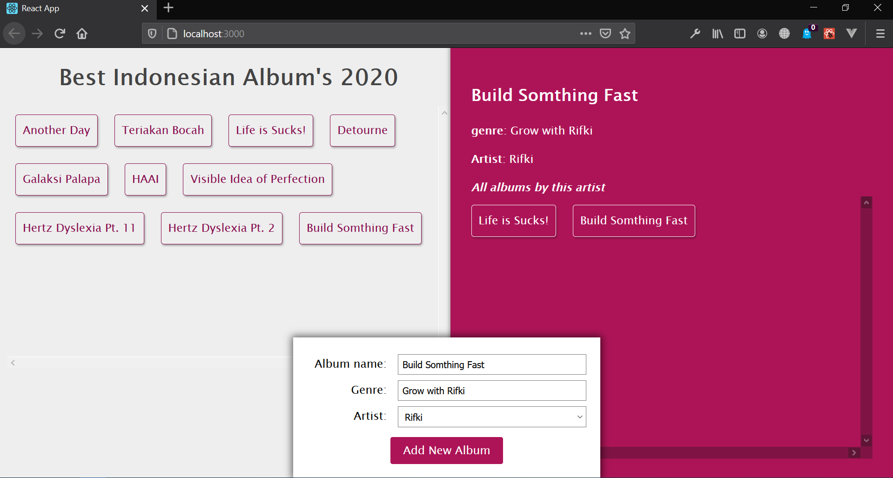

# Album List GraphQL React Application

## Description :clipboard:

> A demo app for using Express, GraphQl, Appollo Client with React and MongoDB

## GraphQL App DEMO

## Installation :wrench:

-   Clone this repo by running `git clone git@github.com:rifkiandriyanto/experiment-musicql-learn-graphql`

### Server setup

-   `cd server`
-   `npm install`
-   `nodemon app`
-   GraphQL will be availabel at `localhost:4000/graphql`

**NOTE:** Start from your root directory

### Client setup

-   `cd client`
-   `npm install`
-   `npm start`
-   Client will be available at `localhost:3000`

**NOTE:** Start from your root directory

## Built With :zap:

1. Node
2. Express
3. GraphQL
4. mongodb
5. React
6. Appollo Client

## License

-   **[MIT license](http://opensource.org/licenses/mit-license.php)**
